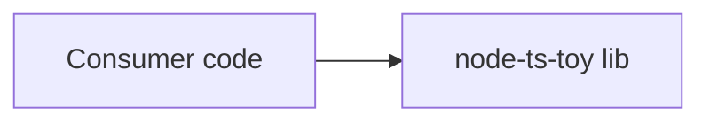

> **Location:** `docs/architecture.md`

# node-ts-toy — Architecture

_Last updated by: nmunozsi (seeded by hand, pre-architect-run) — 2026-05-15_

## 1. Overview

A trivial Node.js + TypeScript toy used as the canonical e2e target for the arandano CLI. Tests run under Vitest; lint is ESLint + typescript-eslint; format is Prettier.

## 2. Components

| Component     | Path             | Responsibility                         | Stack               |
| ------------- | ---------------- | -------------------------------------- | ------------------- |
| Library entry | `src/index.ts`   | Exports the helper functions tasks add | TypeScript          |
| Tests         | `src/__tests__/` | Vitest test files                      | TypeScript / Vitest |

## 3. Data flow

## 4. Tech stack

- **Language(s):** TypeScript 5
- **Runtime:** Node 22
- **Build:** none (consumed as source)
- **Test:** Vitest
- **CI:** GitHub Actions
- **External services / APIs:** none

## 5. Key decisions

_(initial seed — append as plans land)_

## 6. Open questions

_(none yet)_
